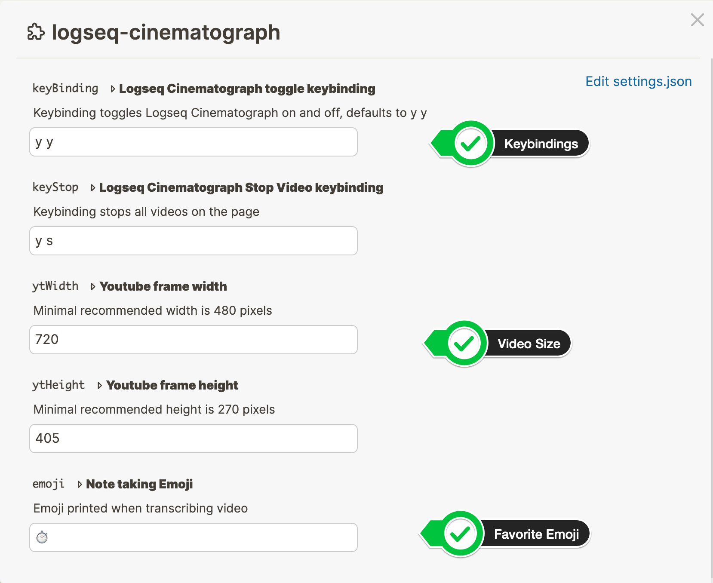

<!--
*** Thanks for checking out the logseq-cinematograph. If you have a suggestion
*** that would make this better, please fork the repo and create a pull request
*** or simply open an issue with the tag "enhancement".
*** Don't forget to give the project a star!
*** Thanks again! Now go create something AMAZING! :D
-->

<!-- PROJECT SHIELDS -->
<!--
*** I'm using markdown "reference style" links for readability.
*** Reference links are enclosed in brackets [ ] instead of parentheses ( ).
*** See the bottom of this document for the declaration of the reference variables
*** for contributors-url, forks-url, etc. This is an optional, concise syntax you may use.
*** https://www.markdownguide.org/basic-syntax/#reference-style-links
-->
[![Contributors][contributors-shield]][contributors-url]
[![Forks][forks-shield]][forks-url]
[![Stargazers][stars-shield]][stars-url]
[![Issues][issues-shield]][issues-url]
[![MIT License][license-shield]][license-url]

<!-- PROJECT LOGO -->
 

  

  <h3 align="center">Logseq Cinematograph</h3>

  

Cinematograph or Kinematograph is an early term for several types of motion picture film mechanisms. A device by this name was invented and patented as the "Cinématographe Léon Bouly" by French inventor Léon Bouly on February 12, 1892. Bouly coined the term "cinematograph," from the Greek for <b>"writing in movement."</b> — [Cinematograph - Wikipedia](https://en.wikipedia.org/wiki/Cinematograph)
     
    <a href="https://github.com/QWxleA/cinematograph"><strong>Explore the docs »</strong></a>
     
     
    <a href="https://github.com/QWxleA/cinematograph">View Demo</a>
    ·
    <a href="https://github.com/QWxleA/cinematograph/issues">Report Bug</a>
    ·
    <a href="https://github.com/QWxleA/cinematograph/issues">Request Feature</a>
  

<!-- TABLE OF CONTENTS -->

  
Table of Contents

  <ol>
    <li>
      <a href="#about-the-project">About The Project</a>
      <ul>
        <li><a href="#built-with">Built With</a></li>
      </ul>
    </li>
    <li>
      <a href="#getting-started">Getting Started</a>
      <ul>
        <li><a href="#prerequisites">Prerequisites</a></li>
        <li><a href="#installation">Installation</a></li>
      </ul>
    </li>
    <li><a href="#Configuration">Configuration</a></li>
    <li><a href="#roadmap">Roadmap</a></li>
    <li><a href="#contributing">Contributing</a></li>
    <li><a href="#license">License</a></li>
    <li><a href="#contact">Contact</a></li>
    <li><a href="#acknowledgments">Acknowledgments</a></li>
  </ol>

<!-- ABOUT THE PROJECT -->
## About The Project

Take notes from a Youtube video is easy enough, but gets annoying when you have too many. And second-guessing yourself also makes it slow going, at times.

All that is solved with this plugin. You can't see what you typed, it just disappears until you're done. Just concentrate on your video, your notes will be there when you're finished. And you type right under the video, so you never scroll too far down.

(<a href="#top">back to top</a>)

<!-- GETTING STARTED -->

## Installation

### Preparation

- Click the 3 dots in the righthand corner and go to **Settings**.
- Go to **Advanced** and enable **Plug-in system**.
- Restart the application.
- Click 3 dots and go to Plugins (or `Esc t p`).

### Install plugin from the Marketplace (recommended) 

- Click the `Marketplace` button and then click `Plugins`.
- Find the plugin and click `Install`.

### Install plugin manually

- Download a released version assets from Github.
- Unzip it.
- Click Load unpacked plugin, and select destination directory to the unzipped folder.

(<a href="#top">back to top</a>)

<!-- Configuration -->
## Configuration

- Click the 3 dots in the righthand corner and go to **Settings**.
- Go to **Plugin Settings**.
- Select correct plugin.

- Set key-bindings
- Set Youtube Video size
- Set emoji

(<a href="#top">back to top</a>)

<!-- ROADMAP -->
## Roadmap

See the [open issues](https://github.com/QWxleA/cinematograph/issues) for a full list of proposed features (and known issues).

(<a href="#top">back to top</a>)

<!-- CONTRIBUTING -->
## Contributing

Contributions are what make the open source community such an amazing place to learn, inspire, and create. Any contributions you make are **greatly appreciated**.

If you have a suggestion that would make this better, please fork the repo and create a pull request. You can also simply open an issue with the tag "enhancement".
Don't forget to give the project a star! Thanks again!

1. Fork the Project
2. Create your Feature Branch (`git checkout -b feature/AmazingFeature`)
3. Commit your Changes (`git commit -m 'Add some AmazingFeature'`)
4. Push to the Branch (`git push origin feature/AmazingFeature`)
5. Open a Pull Request

(<a href="#top">back to top</a>)

<!-- LICENSE -->
## License

Distributed under the MIT License. See `LICENSE.txt` for more information.

(<a href="#top">back to top</a>)

<!-- CONTACT -->
## Contact

Alex Qwxlea - [@twitter_handle](https://twitter.com/QwxleaA) 

Project Link: [https://github.com/Qwxlea/cinematograph](https://github.com/Qwxlea/cinematograph)

(<a href="#top">back to top</a>)

<!-- ACKNOWLEDGMENTS -->
## Acknowledgments

Use this space to list resources you find helpful and would like to give credit to. I've included a few of my favorites to kick things off!

* [Choose an Open Source License](https://choosealicense.com)
* [GitHub Emoji Cheat Sheet](https://www.webpagefx.com/tools/emoji-cheat-sheet)
* [Malven's Flexbox Cheatsheet](https://flexbox.malven.co/)
* [Malven's Grid Cheatsheet](https://grid.malven.co/)
* [Img Shields](https://shields.io)
* [GitHub Pages](https://pages.github.com)
* [Font Awesome](https://fontawesome.com)
* [React Icons](https://react-icons.github.io/react-icons/search)

(<a href="#top">back to top</a>)

<!-- MARKDOWN LINKS & IMAGES -->
<!-- https://www.markdownguide.org/basic-syntax/#reference-style-links -->
[contributors-shield]: https://img.shields.io/github/contributors/QWxleA/logseq-cinematograph.svg?style=for-the-badge
[contributors-url]: https://github.com/QWxleA/cinematograph/graphs/contributors
[forks-shield]: https://img.shields.io/github/forks/QWxleA/logseq-cinematograph.svg?style=for-the-badge
[forks-url]: https://github.com/QWxleA/cinematograph/network/members
[stars-shield]: https://img.shields.io/github/stars/QWxleA/logseq-cinematograph.svg?style=for-the-badge
[stars-url]: https://github.com/QWxleA/cinematograph/stargazers
[issues-shield]: https://img.shields.io/github/issues/QWxleA/logseq-cinematograph.svg?style=for-the-badge
[issues-url]: https://github.com/QWxleA/cinematograph/issues
[license-shield]: https://img.shields.io/github/license/QWxleA/logseq-cinematograph.svg?style=for-the-badge
[license-url]: https://github.com/QWxleA/cinematograph/blob/master/LICENSE.txt
[linkedin-shield]: https://img.shields.io/badge/-LinkedIn-black.svg?style=for-the-badge&logo=linkedin&colorB=555
[linkedin-url]: https://linkedin.com/in/QWxleA
[product-screenshot]: images/screenshot.png

## Using the plugin

## Licence

[MIT](.LICENSE)

### Image license

### Font License

[OFL](./OFL.txt)
